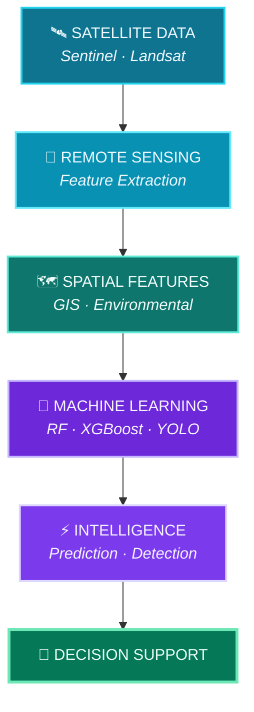
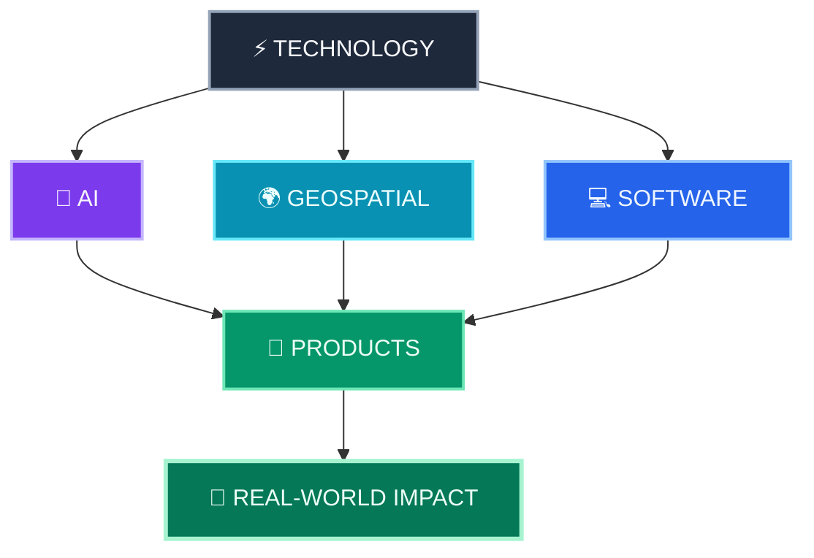

&nbsp;

# 👋🏾 Hi, I'm Mustapha Moshood Olawale

### Senior Software Engineer · AI/ML Engineer · Founder · Geospatial Technologist

  
  
  
  
  

  
  
  

  
  
  
  

## 👨🏾‍💻 About Me

I'm **Mustapha Moshood Olawale**, a **Senior Software Engineer, AI/ML Engineer, Founder and Geospatial Technologist** building software and intelligent systems at the intersection of:

> **Software Engineering × Artificial Intelligence × Geospatial Intelligence × Data**

I work across the full product lifecycle, from **problem discovery and system architecture** to **implementation, deployment, infrastructure and iteration**.

My work spans:

- 🧠 Artificial Intelligence & Machine Learning
- 🌍 Geospatial Intelligence & GIS
- 🛰️ Remote Sensing & Earth Observation
- ⚙️ Backend & Distributed Systems
- 📱 Web & Mobile Applications
- ☁️ Cloud Infrastructure & DevOps
- 🧪 Research & Experimental Systems
- 🚀 Product & Startup Engineering

I particularly enjoy turning complex data into systems that can support **real-world decisions**.

### 🧭 Right Now

<!-- Edit these four lines as things change — they date faster than anything else here. -->

|                     |                                                                    |
| :------------------ | :----------------------------------------------------------------- |
| 🔭 **Building**     | Geospatial and climate intelligence systems at **StrikeClimate**   |
| 🌱 **Learning**     | Advanced remote sensing pipelines and geospatial foundation models |
| 💬 **Ask me about** | Geospatial AI · Backend architecture · Rust systems · LLMs & RAG   |
| 🤝 **Open to**      | Collaborations, technical advisory and ambitious product builds    |

# ⚡ Engineering at a Glance

<table>
<tr>
<td width="50%" valign="top">

### 🧠 AI / ML

</td>

<td width="50%" valign="top">

### 🌍 Geospatial

</td>
</tr>

<tr>
<td valign="top">

### ⚙️ Software Engineering

</td>

<td valign="top">

### ☁️ Cloud & Infrastructure

</td>
</tr>
</table>

# 🧰 Technology Stack

<strong>💻 Languages</strong>

 

| Category       | Technologies                                                                                                                                                                                                                                                                                                                                                                |
| :------------- | :-------------------------------------------------------------------------------------------------------------------------------------------------------------------------------------------------------------------------------------------------------------------------------------------------------------------------------------------------------------------------- |
| **Core**       |                                            |
| **Systems**    |     |
| **Additional** |                                                                                      |

<strong>⚙️ Backend & APIs</strong>

 

| Category             | Technologies                                                                                                                                                                                                                                                                                                                                                                                                                                                                                                                                                    |
| :------------------- | :-------------------------------------------------------------------------------------------------------------------------------------------------------------------------------------------------------------------------------------------------------------------------------------------------------------------------------------------------------------------------------------------------------------------------------------------------------------------------------------------------------------------------------------------------------------- |
| **Python**           |                                                                                                                                         |
| **Node / JS**        |                                                                                                                                                                                                                                                                                                                                                     |
| **PHP / .NET**       |                                                                                                                                                                                                                                                                                                                                                            |
| **API Architecture** |       |

<strong>🎨 Frontend & Mobile</strong>

 

| Category          | Technologies                                                                                                                                                                                                                                                                                                                                                                                                     |
| :---------------- | :--------------------------------------------------------------------------------------------------------------------------------------------------------------------------------------------------------------------------------------------------------------------------------------------------------------------------------------------------------------------------------------------------------------- |
| **Frontend**      |     |
| **Mobile**        |                                                                                                                                                                                                    |
| **State**         |                                                                                                                                                                                                                                                                                                                  |
| **3D / Graphics** |                                                                                                                                                                                                                                                                                                         |

<strong>🤖 AI / Machine Learning</strong>

 

| Category          | Technologies                                                                                                                                                                                                                                                                                                                                                                                                                                                                                                                                                                                                              |
| :---------------- | :------------------------------------------------------------------------------------------------------------------------------------------------------------------------------------------------------------------------------------------------------------------------------------------------------------------------------------------------------------------------------------------------------------------------------------------------------------------------------------------------------------------------------------------------------------------------------------------------------------------------ |
| **Frameworks**    |                                                                                                                                                                                                                                                                                                      |
| **ML Ecosystem**  |                                                                                                                                                                                                                                                                                                                                                                                  |
| **Generative AI** |                                                                                                                                                                                                                |
| **Applications**  |        |

<strong>🌍 Geospatial & Earth Observation</strong>

 

| Category               | Technologies / Data                                                                                                                                                                                                                                                                                                                                                                                                                                                                                                    |
| :--------------------- | :--------------------------------------------------------------------------------------------------------------------------------------------------------------------------------------------------------------------------------------------------------------------------------------------------------------------------------------------------------------------------------------------------------------------------------------------------------------------------------------------------------------------- |
| **GIS / Spatial**      |                                           |
| **Earth Observation**  |                                                                                                                                       |
| **Environmental Data** |                                                                                                                               |
| **Platform**           |                                                                                                                                                                                                                                                                                                                                                                                  |
| **Applications**       |      |

<strong>🗄️ Data & Messaging</strong>

 

| Category             | Technologies                                                                                                                                                                                                                                                                                                                                |
| :------------------- | :------------------------------------------------------------------------------------------------------------------------------------------------------------------------------------------------------------------------------------------------------------------------------------------------------------------------------------------ |
| **SQL**              |                                                                                                                              |
| **NoSQL**            |                                                                                                                                                                                                                                       |
| **Caching / ORM**    |                                                                                                                                          |
| **Messaging**        |                                                                                                                                                                                                                                                |
| **Data Engineering** |     |

<strong>☁️ Cloud, DevOps & Infrastructure</strong>

 

| Category           | Technologies                                                                                                                                                                                                                                                                                                                                                                                                                                                                                                                                                                                                                                                                                                                                         |
| :----------------- | :--------------------------------------------------------------------------------------------------------------------------------------------------------------------------------------------------------------------------------------------------------------------------------------------------------------------------------------------------------------------------------------------------------------------------------------------------------------------------------------------------------------------------------------------------------------------------------------------------------------------------------------------------------------------------------------------------------------------------------------------------- |
| **Cloud**          |                                                                                                                                                                                                                                                                                                                                                                                                                                           |
| **Platforms**      |                                                                                                                                                                                                                                                                                                                                                                                                                                                                                                                              |
| **Containers**     |                                                                                                                                                                                                                                                                                                                                                                                                                                                                                                                                                                                                                                                   |
| **CI/CD**          |                                                                                                                                                                                                                                                                                                                                                                                                                                                                                                                 |
| **Infrastructure** |        |

<strong>🧪 Testing & Quality</strong>

 

<strong>🔐 Security & Defensive Engineering</strong>

 

| Category                | Tools / Areas                                                                                                                                                                                                                                                                                                                                                                                                                                                               |
| :---------------------- | :-------------------------------------------------------------------------------------------------------------------------------------------------------------------------------------------------------------------------------------------------------------------------------------------------------------------------------------------------------------------------------------------------------------------------------------------------------------------------- |
| **Security Testing**    |                                                                    |
| **Security Platforms**  |                                                                                                                                                                                                                                              |
| **Security Frameworks** |                                                                                                                                                                                                                                                                                      |
| **Practices**           |      |

<strong>📋 Standards & Compliance</strong>

 

# 📊 GitHub Statistics

<!-- 

  -->

 

<!--  -->

# 🚀 Products, Ventures & Engineering

<table>
<tr>

<td width="33%" valign="top">

### 🌍 LocateMeeee

 

A marketplace concept focused on connecting buyers and vendors across Nigerian markets.

**Focus**

`Marketplace` `Location` `Commerce` `Digital Platforms`

</td>

<td width="33%" valign="top">

### 🌱 StrikeClimate

  

Building agricultural and climate intelligence systems using geospatial data, remote sensing and machine learning.

**Products**

`AgScaleSys`
`IrriDetect`

</td>

<td width="33%" valign="top">

### ⚡ AttroTech

 

Building practical digital systems for organizations, businesses and communities.

**Focus**

`SaaS` `Automation` `PWA` `Business Systems`

</td>

</tr>

<tr>

<td width="33%" valign="top">

### 🛠️ Build With MMO

  

A technology initiative focused on building, experimenting, learning and creating practical software solutions.

**Focus**

`Software Engineering` `AI` `Product Building` `Technology`

</td>

<td width="33%" valign="top">

### 🤖 FolamiFit AI

  

An AI-powered fitness technology initiative focused on using intelligent systems to create personalised fitness experiences.

**Focus**

`Artificial Intelligence` `Machine Learning` `Fitness Technology` `Personalisation`

</td>

<td width="33%" valign="top">

### 🌍 ReviveLifeTech

  

A technology initiative focused on developing innovative digital solutions to address real-world challenges and create meaningful impact.

**Focus**

`Innovation` `Technology` `Social Impact` `Digital Solutions`

</td>

</tr>

</table>

# 🌾 Geospatial + AI

One of the areas I find most interesting is the intersection of **satellite data, machine learning and software engineering**.

### Areas of application

# 🧠 Engineering Philosophy

> **Don't just write code. Build systems that matter.**

I think beyond implementation.

```mermaid
flowchart LR
    P["Problem"] --> R["Requirements"] --> A["Architecture"] --> I["Implementation"] --> T["Testing"]
    T --> D["Deployment"] --> M["Monitoring"] --> ME["Measurement"] --> IT["Iteration"]
    IT -.-> R

    classDef discover fill:#7C3AED,stroke:#C4B5FD,stroke-width:2px,color:#F5F3FF
    classDef build fill:#2563EB,stroke:#93C5FD,stroke-width:2px,color:#EFF6FF
    classDef run fill:#0891B2,stroke:#67E8F9,stroke-width:2px,color:#ECFEFF
    classDef learn fill:#059669,stroke:#6EE7B7,stroke-width:2px,color:#ECFDF5

    class P,R discover
    class A,I,T build
    class D,M run
    class ME,IT learn
```

Good software should not only **work**.

It should be:

| Principle                                                                                    | What it means                             |
| :------------------------------------------------------------------------------------------- | :---------------------------------------- |
|      | Easy for people to understand and evolve  |
|          | Efficient enough for its workload         |
|                  | Designed with security in mind            |
|              | Able to grow with the product             |
|              | Behaviour can be validated                |
|          | Problems can be detected and investigated |
|  | Complexity is managed rather than hidden  |

# 🔬 Current Technical Interests

<table>
<tr>
<td align="center">🤖 <b>Artificial Intelligence</b></td>
<td align="center">🛰️ <b>Geospatial AI</b></td>
<td align="center">🌍 <b>Remote Sensing</b></td>
<td align="center">🌾 <b>AgTech</b></td>
</tr>
<tr>
<td align="center">🌱 <b>ClimateTech</b></td>
<td align="center">👁️ <b>Computer Vision</b></td>
<td align="center">🧠 <b>LLMs & RAG</b></td>
<td align="center">⚙️ <b>Distributed Systems</b></td>
</tr>
<tr>
<td align="center">☁️ <b>Cloud Infrastructure</b></td>
<td align="center">🚀 <b>Product Engineering</b></td>
<td align="center">📊 <b>Data Platforms</b></td>
<td align="center">🔬 <b>Technical Research</b></td>
</tr>
</table>

# 🧩 What I Bring to a Project

<table>
<tr>
<th align="left">From</th>
<th align="center">→</th>
<th align="left">To</th>
</tr>
<tr>
<td>💡 Idea</td>
<td align="center"></td>
<td>🏗️ Technical Architecture</td>
</tr>
<tr>
<td>📐 Requirements</td>
<td align="center"></td>
<td>⚙️ Production System</td>
</tr>
<tr>
<td>📊 Raw Data</td>
<td align="center"></td>
<td>🧠 Intelligence</td>
</tr>
<tr>
<td>🛰️ Satellite Imagery</td>
<td align="center"></td>
<td>🌍 Geospatial Insights</td>
</tr>
<tr>
<td>🧪 Prototype</td>
<td align="center"></td>
<td>🚀 Deployable Product</td>
</tr>
<tr>
<td>🎯 Product Problem</td>
<td align="center"></td>
<td>💻 Engineering Solution</td>
</tr>
</table>

# 📌 Areas of Expertise

| Domain                                                                                               | Focus                                                           |
| :--------------------------------------------------------------------------------------------------- | :-------------------------------------------------------------- |
|                  | Machine Learning · Computer Vision · LLMs · RAG · Generative AI |
|                  | GIS · Remote Sensing · Spatial Analysis · Geospatial AI         |
|  | Sentinel · Landsat · MODIS · SRTM · Environmental Data          |
|                        | Django · FastAPI · Flask · Node.js · REST · GraphQL             |
|                      | React · Next.js · Angular · Nuxt · Redux                        |
|                          | React Native · Expo                                             |
|                              | PostgreSQL · MySQL · MongoDB · Redis · Prisma · MQTT            |
|                            | AWS · Azure · GCP · DigitalOcean · Heroku                       |
|                          | Docker · GitHub Actions · CircleCI · Linux · Nginx              |
|                        | Jest · Cypress · Unit · Integration · E2E                       |
|                      | OWASP · Burp Suite · ZAP · Nmap · Wireshark · MITRE ATT&CK      |
|                    | ISO 27001 · NIST · SOC 2 · GDPR · CIS Benchmarks                |

# 🌐 Beyond the Code

I enjoy working across the intersection of:

That means I'm interested not only in **how something is built**, but also:

- Why it should exist
- Who it serves
- How it scales
- How the data flows
- How the system behaves in production
- How users interact with it
- How the product can evolve

# 🤝 Let's Build

I'm interested in collaborating on meaningful projects across:

If you're building something ambitious, I'm interested in discussing the engineering behind it.

## 🚀 Build. Ship. Learn. Iterate.

<picture>
  <source media="(prefers-color-scheme: dark)" srcset="https://raw.githubusercontent.com/olawale1rty/olawale1rty/output/github-snake-dark.svg"/>
  <source media="(prefers-color-scheme: light)" srcset="https://raw.githubusercontent.com/olawale1rty/olawale1rty/output/github-snake.svg"/>
  
</picture>

  

  

**Mustapha Moshood Olawale**

_Senior Software Engineer · AI/ML Engineer · Founder · Geospatial Technologist_

